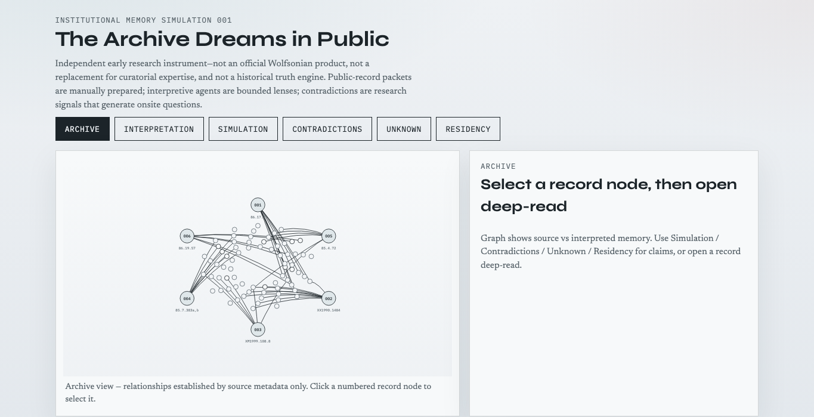
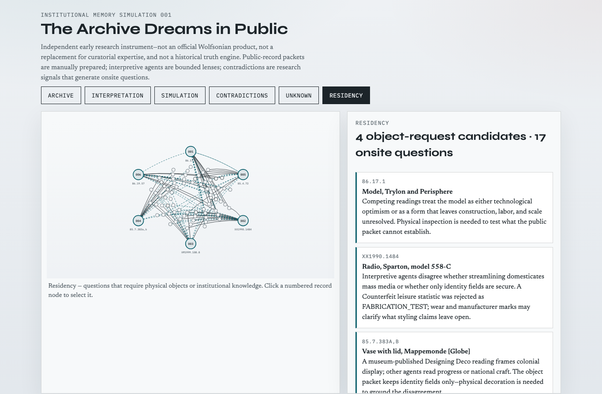
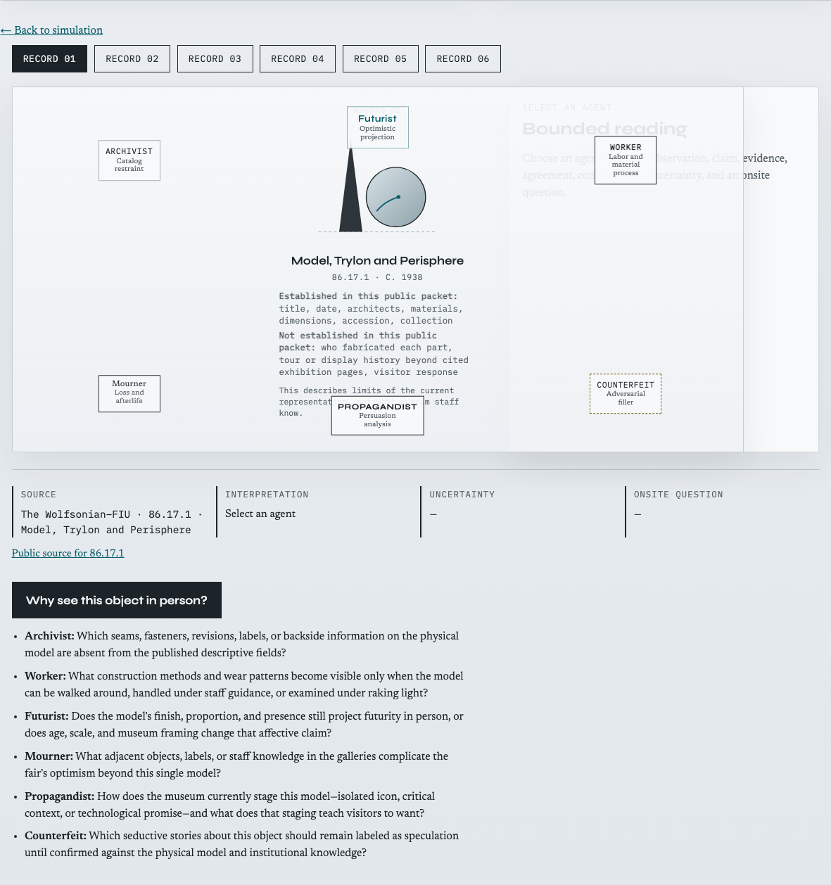

# Wolfsonian Public API Research

An independent research notebook exploring The Wolfsonian–FIU's publicly documented digital collection—and a static browser **Research Demo 001** for sharing the methodology before onsite work.

It is **not** an official Wolfsonian application, production system, or museum-authored dataset.

## Research Demo 001 (on `main`)

**The Archive Dreams in Public — Institutional Memory Simulation**

**Live demo:** [https://wolfsonian-research.vercel.app/demo/](https://wolfsonian-research.vercel.app/demo/)

Canonical research repository: [github.com/moisestech/wolfsonian-public-api-research](https://github.com/moisestech/wolfsonian-public-api-research)




*Contradictions and gaps become candidates for physical collection research.*



### What to notice in under a minute

1. These are **public** Wolfsonian source records (manually prepared packets).
2. Agents are **bounded interpretive lenses**, not oracles.
3. **Interpretation is separated** from evidence.
4. Contradictions are **useful research signals**, not “AI errors.”
5. **Uncertainty is visible** (`UNCERTAIN` / gaps).
6. Output includes **onsite questions** and object-request candidates (Residency).
7. This is an **early research instrument**, not a finished museum product or truth engine.

### Local preview

```bash
npm run build:demo
npm test
npx --yes serve .
# open /demo/
```

### Data layout (source of truth vs build output)

| Path | Role |
|---|---|
| [`data/public/objects/`](data/public/objects/) | Layer A — public source packets (edit here) |
| [`data/research/`](data/research/) | Layer B — interpretations, simulations, object-request candidates |
| [`demo/data/`](demo/data/) | **Committed build output** of `npm run build:demo` for static hosting |

Do not hand-edit `demo/data` as authoritative; regenerate after changing Layer A/B.

### Images & representations

The demo ships **original diagrammatic SVGs only** (not museum collection photography):

| File | Object |
|---|---|
| [`demo/assets/objects/trylon-perisphere.svg`](demo/assets/objects/trylon-perisphere.svg) | 86.17.1 Trylon and Perisphere |
| [`demo/assets/objects/sparton-radio.svg`](demo/assets/objects/sparton-radio.svg) | XX1990.1484 Sparton 558-C |
| [`demo/assets/objects/machine-age-catalogue.svg`](demo/assets/objects/machine-age-catalogue.svg) | XM1999.108.8 Machine Age catalogue |
| [`demo/assets/objects/mappemonde-vase.svg`](demo/assets/objects/mappemonde-vase.svg) | 85.7.383a,b Mappemonde |
| [`demo/assets/objects/poster-in-1939.svg`](demo/assets/objects/poster-in-1939.svg) | 85.4.72 Poster In 1939 |
| [`demo/assets/objects/program-tomorrow.svg`](demo/assets/objects/program-tomorrow.svg) | 86.19.57 Your World of Tomorrow |
| [`demo/assets/objects/futurama-booklet.svg`](demo/assets/objects/futurama-booklet.svg) | WOLF-007 corpus extra |
| [`demo/assets/objects/rca-television.svg`](demo/assets/objects/rca-television.svg) | WOLF-008 corpus extra |
| [`demo/assets/objects/generic-record.svg`](demo/assets/objects/generic-record.svg) | Fallback mark |

**Do not add** collection photography, staff photos, or scraped Turnstile HTML images until rights are clarified with the institution.

**Optional later (not required for sharing):** one original OG/social preview card (SVG or generated graphic—not a collection photo) for link unfurls.

### Hosting

**Vercel:** project `wolfsonian-research` → [https://wolfsonian-research.vercel.app](https://wolfsonian-research.vercel.app). Config: [`vercel.json`](vercel.json). Production should track **`main`**. Do not attach `moises.tech`.

If GitHub auto-deploy is not connected yet (requires a Vercel↔GitHub login connection in the dashboard), redeploy from this repo with:

```bash
npx vercel@latest --prod
```

**GitHub Pages (optional):** [`.github/workflows/pages.yml`](.github/workflows/pages.yml). Account-level `*.github.io` → `www.moises.tech` redirects can still break project Pages; prefer Vercel for the shareable URL.

### Corpus shipped in the demo

- **6 verified public-record packets** (schema capacity 30; WOLF-007/008 remain as corpus extras)
- Deterministic graph + **5 simulation rounds**
- Six bounded agents + The Museum (in rounds)
- Views: Archive / Interpretation / Simulation / Contradictions / Unknown / **Residency**
- Residency lists **object-request candidates** from contradictions
- Counterfeit claims labeled `FABRICATION_TEST` and challenged by Archivist
- No live API, no LLM, no museum photography

Docs: [`docs/demo-methodology.md`](docs/demo-methodology.md) · [`docs/simulation-architecture.md`](docs/simulation-architecture.md) · [`docs/object-selection-method.md`](docs/object-selection-method.md) · [`docs/mirofish-comparison.md`](docs/mirofish-comparison.md) · [`docs/future-simulation-tech.md`](docs/future-simulation-tech.md)

## Why this exists

> What kind of institutional world can be inferred from a museum's public digital record, and what remains unavailable until code encounters physical objects and the people who care for them?

## Current capabilities

- Browser Research Demo 001 (static packets, graph, rounds, residency requests)
- Record deep-read tableau with six bounded agents and provenance ledger
- Build documented search, statistics, citation, brief-item, XML metadata, random-item, and thumbnail URLs
- Ping representative endpoints; detect Turnstile verification pages
- Save timestamped search and item packets locally (CLI)

## Requirements

- Node.js 20 or newer
- No API key required for the demo

## Setup

```bash
npm install
cp .env.example .env
npm run build:demo
npm test
npm run ping
```

## Live API status

Automated requests to `digital.wolfsonian.org` may receive Cloudflare Turnstile. The demo does not depend on live access. See README history and `.env.example` for optional local cookie research.

## Status

**Version 0.4.0 — Research Demo 001 on `main`**

| Milestone | State |
|---|---|
| CLI URL builders + Turnstile detection | Done |
| Dual-layer public/research data | Done |
| Research Demo 001 (6 seeds, 5 rounds, Residency requests) | Done — merged to `main` |
| Institution-safe packet language (`not_established_in_public_packet`) | Done |
| Vercel demo URL | Live |
| GitHub Actions Pages workflow | Optional secondary path |
| Live API packet under `data/raw/` | Blocked on verification / approved access |
| Satellite materials for each anchor (~12–16 request set) | Next research phase |
| Generative LLM agents / crowd-sim visualization | Later — see [`docs/future-simulation-tech.md`](docs/future-simulation-tech.md) |

### Merge history (complete)

Stacked PRs #1 → #2 → #3 were merged to `main` in order (Trial 001 → Simulation 001 → Research Demo 001 hardening). No further stack retargeting required.
